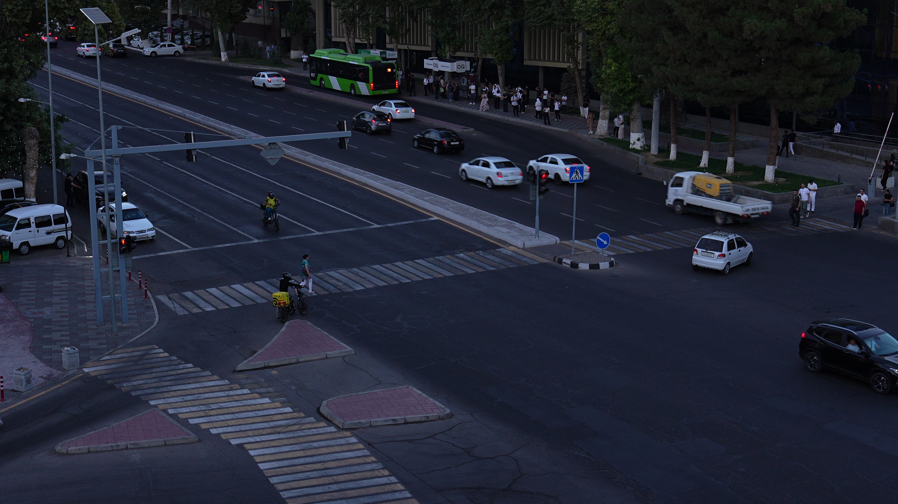

# Scene layout

The camera looks at a signalised junction in Tashkent. The layout was drawn by
hand on the first frame of `C3905.MP4`, which is kept as `assets/scene_ref.jpg`
(1920×1080). All coordinates in `src/scene.py` are in that frame at 4K
(3840×2160). The organizers said to ignore `camera.md`, and no such file was provided.

## Camera drift between recordings

The task describes the camera as fixed, but in the samples its pose drifts
slightly between recordings. SIFT + RANSAC similarity against the reference
frame (`src/registration.py`) gives:

| video | shift x (px, 4K) | shift y | scale | rotation |
|---|---|---|---|---|
| C3905 | 0 | −2 | 1.000 | 0.00° |
| C3902 | −91 | +28 | 1.002 | 0.31° |
| C3896 | +45 | −42 | 0.985 | 1.01° |
| C3897 | +35 | −41 | 0.987 | 1.02° |

Without correction, the stop lines would be off by up to ~60 px at the frame edges
in C3896/C3897. In C3902 the traffic-signal window would land on the
pedestrian-crossing sign instead of the lamps. Every video is therefore
registered once at start-up: 3 frames, median transform, plausibility bounds,
and identity/scale-only fallback. The transform is applied to every zone, line
and lamp.

## Zones

| key | meaning | who may be there |
|---|---|---|
| `stop_line_strict` | stop line of `lane_ltr` | vehicles must not cross it on red |
| `stop_line_tolerance` | edge of the first zebra; stopping between the two lines in a queue is tolerated | vehicles stopped beyond it on red → `stop_line` |
| `yield_ped_line` | right-side line where drivers yield to pedestrians | — |
| `crosswalks` (3) | zebra crossings | pedestrians |
| `lane_ltr` | main road, direction towards the junction (flow ≈ (0.94, 0.36) in image space) | vehicles |
| `lane_rtl` | main road, opposite direction | vehicles |
| `intersection_core`, `lower_core` | junction box | vehicles (must yield at zebras) |
| `right_turn_zone` | right-turn slip from `lane_ltr` | vehicles (yield at zebra) |
| `ped_refuge` (4) | islands between the zebras | pedestrians only |
| `barriers` (2) | physical dividers | nobody (a vehicle hitting one is a crash) |
| `sidewalks` (2) | off-carriageway areas | pedestrians |
| `main_signal_lamps` | red / yellow / green lamp centres of the `lane_ltr` signal | — |

## Traffic signal

The signal is read from the lamps, not from a colour mask over the housing,
because a lit lamp is only ~5 px tall at 4K. `scripts/signal_timeline.py`
prints one state per second. On all four samples it shows a clean cycle:
~37 s red, ~35 s green, and 3–6 s of amber/transition. An unlit red lamp scores ≤ 10, a lit one ≥ 45
(day) and ≥ 220 (dusk). An unlit green lamp scores ≤ 17, a lit one ≥ 126.
